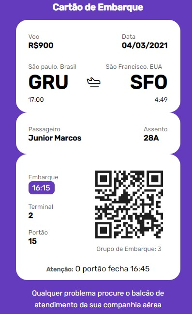

# Projeto Cartão de Embarque

Cartão de Embarque

 

Layout de um cartão de embarque ✈

## Índice
- <a href="#layout">Layout</a>
- <a href="#technology">Tecnologias Utilizadas</a>
- <a href="#people">Pessoas Autoras</a>
- <a href="#next">Próximos Passos</a>

## Layout

## Tecnologias Utilizadas
- HTML
- CSS

## Pessoas Autoras
Junior Dange
 
<a href="https://www.linkedin.com/in/junior-dange-ba1356257/" target="_blank">Linkedin</a>

## Próximos Passos
- [ ] Melhorar o layout
- [ ] Criar um gerador de cartões